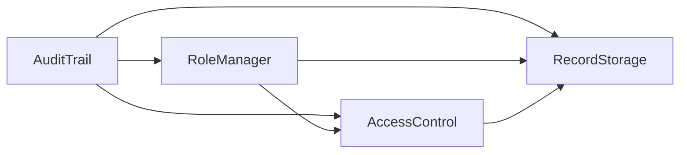

# Healthchain - System Documentation (Global Inline Reference)

This document provides a global technical view of the Healthchain project, with inline documentation for every file currently present in the repository.

It is intended for:
- New contributors onboarding to the codebase
- Developers integrating frontend and smart contracts
- Reviewers who need a complete architecture + file-level map

---

## 1. Global System View

Healthchain is a decentralized healthcare record management DApp with 3 major layers:

1. On-chain logic (Ethereum smart contracts, Solidity)
- Role and identity management (admin/doctor/patient)
- Consent/access control between patients and doctors
- Medical record metadata storage
- Immutable audit logging

2. Off-chain file storage (IPFS via Pinata)
- Optional clinical files are uploaded to Pinata
- IPFS CID is saved on-chain in each medical record

3. Frontend client (React + Vite)
- Wallet connection via MetaMask
- Role-based routing and dashboard views
- Contract calls using ethers.js

Important architecture note:
- There is no traditional centralized backend API server in this repo.
- The "backend" in this project is the blockchain contract layer + Hardhat deployment/testing tooling.

---

## 2. Smart Contract Architecture

### 2.1 Dependency graph

Deployment order must be:
1. AuditTrail
2. RoleManager (needs AuditTrail address)
3. AccessControl (needs RoleManager + AuditTrail)
4. RecordStorage (needs RoleManager + AccessControl + AuditTrail)

### 2.2 Contract responsibilities

#### `blockchain/contracts/AuditTrail.sol`
Purpose:
- Append-only on-chain event log for protocol actions

Core types:
- `enum ActionType { DOCTOR_REGISTERED, PATIENT_REGISTERED, ACCESS_GRANTED, ACCESS_REVOKED, RECORD_CREATED, RECORD_VIEWED }`
- `struct AuditEntry { id, actionType, performer, subject, details, timestamp }`

State:
- `AuditEntry[] public entries`
- `mapping(address => uint256[]) private userEntries`

Core functions:
- `log(ActionType _actionType, address _performer, address _subject, string _details)`
- `getEntry(uint256 _id)`
- `getUserAuditIds(address _user)`
- `getAllEntryIds()`
- `getTotalEntries()`

Event:
- `AuditLogged(uint256 id, ActionType actionType, address performer, address subject)`

Notes:
- Any caller can call `log(...)` in current implementation.
- Contract-level integrations call it internally during role/access/record actions.

---

#### `blockchain/contracts/RoleManager.sol`
Purpose:
- Canonical role registry for all wallets

Role model:
- `Role.None = 0`
- `Role.Admin = 1`
- `Role.Doctor = 2`
- `Role.Patient = 3`

State:
- `address public admin`
- `AuditTrail public auditTrail`
- `mapping(address => Role) public roles`
- `address[] public doctorList`
- `address[] public patientList`

Core functions:
- `registerDoctor(address _doctor)` (admin only)
- `registerPatient()` (self-registration)
- `getRole(address _addr)`
- `getDoctorCount()` / `getPatientCount()`
- `getDoctors()` / `getPatients()`

Events:
- `DoctorRegistered(address doctor)`
- `PatientRegistered(address patient)`

Rules:
- Deployer is assigned admin in constructor
- One wallet can only hold one role (no role reassignment mechanism)

---

#### `blockchain/contracts/AccessControl.sol`
Purpose:
- Patient-controlled consent for doctor access

Core type:
- `struct Access { bool isGranted; uint256 grantedAt; uint256 expiresAt; }`
- `expiresAt == 0` means permanent access

State:
- `RoleManager public roleManager`
- `AuditTrail public auditTrail`
- `mapping(address => mapping(address => Access)) public accessMap` (patient -> doctor -> Access)
- `mapping(address => address[]) public patientDoctors`
- `mapping(address => address[]) public doctorPatients`

Core functions:
- `grantAccess(address _doctor, uint256 _durationSeconds)`
- `revokeAccess(address _doctor)`
- `hasAccess(address _patient, address _doctor)`
- `getPatientDoctors(address _patient)`
- `getDoctorPatients(address _doctor)`

Events:
- `AccessGranted(address patient, address doctor, uint256 expiresAt)`
- `AccessRevoked(address patient, address doctor)`

Rules:
- Only wallets with Patient role can grant/revoke
- Doctor target must have Doctor role
- Duplicate grants are blocked while `isGranted` is true
- Expiry does not auto-remove doctor/patient list entries; explicit revoke is required to clear them and allow a fresh grant

---

#### `blockchain/contracts/RecordStorage.sol`
Purpose:
- On-chain storage of medical record metadata and IPFS CID

Core type:
- `struct MedicalRecord { id, patient, doctor, diagnosis, prescription, notes, ipfsHash, createdAt }`

State:
- `RoleManager public roleManager`
- `AccessControl public accessControl`
- `AuditTrail public auditTrail`
- `MedicalRecord[] public records`
- `mapping(address => uint256[]) private patientRecords`

Core functions:
- `createRecord(address _patient, string _diagnosis, string _prescription, string _notes, string _ipfsHash)`
- `getRecord(uint256 _id)`
- `getPatientRecordIds(address _patient)`
- `getTotalRecords()`

Event:
- `RecordCreated(uint256 id, address patient, address doctor)`

Rules:
- Only Doctor role can create records
- Must pass access check: `accessControl.hasAccess(_patient, msg.sender)`

---

### 2.3 On-chain permission summary

| Actor | Allowed actions |
|---|---|
| Admin | Register doctors |
| Doctor | Create records only when `hasAccess(patient, doctor)` returns `true` |
| Patient | Self-register and manage consent (`grantAccess` / `revokeAccess`) |
| Any role | Call public view methods, including `getPatientRecordIds` and `getRecord` |

---

## 3. Backend / Hardhat Layer

### 3.1 Toolchain
- Solidity `0.8.19`
- Hardhat `^2.28.6`
- Hardhat Toolbox `^4.0.0`
- dotenv for env vars

### 3.2 Network config (`blockchain/hardhat.config.js`)
Defined networks:
- `localhost`: `http://127.0.0.1:8545`, chainId `31337`
- `sepolia`: URL from `SEPOLIA_RPC_URL`, key from `PRIVATE_KEY`, chainId `11155111`

### 3.3 Deployment pipeline (`blockchain/scripts/deploy.js`)
Flow:
1. Deploy `AuditTrail`
2. Deploy `RoleManager(auditTrailAddr)`
3. Deploy `AccessControl(roleManagerAddr, auditTrailAddr)`
4. Deploy `RecordStorage(roleManagerAddr, accessControlAddr, auditTrailAddr)`
5. Print addresses for frontend `src/config/contracts.js`

### 3.4 Test suite (`blockchain/test/*.test.js`)
Total unit tests in repository: 22

- `RoleManager.test.js` (8 tests)
  - Admin assignment
  - Doctor/patient registration
  - Permission checks
  - Audit trail side effects
  - List retrieval

- `AccessControl.test.js` (6 tests)
  - Grant/revoke behavior
  - Patient-only restrictions
  - Doctor-role validation
  - Relationship indexing
  - Expiry with EVM time travel

- `RecordStorage.test.js` (5 tests)
  - Doctor create record success path
  - Deny on revoked/no access
  - Deny non-doctor create
  - Patient record ID index
  - Total record counter

- `AuditTrail.test.js` (3 tests)
  - Entry logging
  - Per-user index retrieval
  - Total entry count

Note:
- `blockchain/package.json` currently has placeholder test script (`"test": "echo ..."`), so tests are usually run with Hardhat command directly.

---

## 4. Frontend Architecture

### 4.1 App shell and routes

`frontend/src/App.jsx` configures:
- Router
- Web3 provider context
- Global toast notifications
- Role-protected routes via `RoleGuard`

Routes:
- `/` -> `Landing`
- `/admin` -> `AdminDashboard` (role: admin)
- `/doctor` -> `DoctorDashboard` (role: doctor)
- `/patient` -> `PatientDashboard` (role: patient)

### 4.2 Web3 context (`frontend/src/context/Web3Context.jsx`)
Responsibilities:
- Connect MetaMask
- Build ethers provider and signer
- Instantiate contract instances with ABI + address
- Resolve user role (`roleManager.getRole(address)`)
- Expose app-wide state + helpers via context

Notable behavior:
- Read RPC methods can be routed through `VITE_SEPOLIA_RPC_URL` by overriding provider `send` for selected JSON-RPC methods.
- Writes still use signer/MetaMask flow.
- Handles account/chain change events.
- Includes `addSepoliaNetwork()` helper for wallet network setup.

### 4.3 Contract wiring in frontend
- ABI files in `frontend/src/abis/*.json`
- Addresses in `frontend/src/config/contracts.js`
- Contract objects created in `Web3Context`

If contracts are redeployed, `contracts.js` must be updated manually.

### 4.4 IPFS integration
- `frontend/src/utils/ipfs.js`
  - `uploadToIPFS(file)` -> uses Pinata API
  - `getIPFSUrl(cid)` -> constructs gateway URL
- `frontend/src/config/pinata.js`
  - Reads `VITE_PINATA_API_KEY`, `VITE_PINATA_API_SECRET`

### 4.5 Dashboard/page responsibilities

- `Landing.jsx`
  - Wallet connect
  - Optional `addSepoliaNetwork`
  - Patient self-registration flow
  - Redirects to role dashboard if already registered

- `AdminDashboard.jsx`
  - Clinician registration panel
  - Protocol stats
  - Global audit log view (`showAll=true`)

- `DoctorDashboard.jsx`
  - Patient list from granted access
  - Create and view patient records
  - Personal audit log

- `PatientDashboard.jsx`
  - Grant access and revoke access controls
  - View own medical records
  - Personal audit log

### 4.6 Frontend -> contract method matrix

| Frontend file | Contract call(s) | Type |
|---|---|---|
| `Landing.jsx` | `roleManager.registerPatient()` | write |
| `RegisterDoctor.jsx` | `roleManager.registerDoctor(address)` | write |
| `SystemStats.jsx` | `getDoctorCount`, `getPatientCount`, `getTotalRecords`, `getTotalEntries` | read |
| `GrantAccess.jsx` | `accessControl.grantAccess(doctor, duration)` | write |
| `ManageAccess.jsx` | `getPatientDoctors(account)`, `revokeAccess(doctor)` | read + write |
| `PatientList.jsx` | `getDoctorPatients(account)` | read |
| `CreateRecord.jsx` | `recordStorage.createRecord(...)` | write |
| `ViewRecords.jsx` | `getPatientRecordIds(patient)`, `getRecord(id)` | read |
| `MyRecords.jsx` | `getPatientRecordIds(account)`, `getRecord(id)` | read |
| `AuditLog.jsx` | `getTotalEntries`, `getEntry(i)`, `getUserAuditIds(account)` | read |

---

## 5. End-to-End Runtime Flows

### Flow A: Patient onboarding
1. User connects MetaMask from landing page.
2. Frontend fetches role from `RoleManager`.
3. If role is `none`, user can call `registerPatient()`.
4. Transaction mined -> role refresh -> route to `/patient`.

### Flow B: Admin provisions doctor
1. Admin enters wallet address in `RegisterDoctor`.
2. Calls `registerDoctor(address)`.
3. `RoleManager` writes role + list entry and logs action in `AuditTrail`.
4. Doctor can then access `/doctor` dashboard.

### Flow C: Patient grants/revokes consent
1. Patient grants via `grantAccess(doctor, duration)`.
2. Access map and relationship arrays update.
3. Doctor now appears in patient's granted list; patient appears in doctor's granted-by list.
4. Patient can revoke via `revokeAccess(doctor)`.
5. If a timed grant expires, `hasAccess` returns false, but list entries remain until revoke.

### Flow D: Doctor creates medical record
1. Doctor selects patient from `PatientList`.
2. Optionally uploads attachment to IPFS via Pinata and receives CID.
3. Calls `createRecord(patient, diagnosis, prescription, notes, ipfsHash)`.
4. Contract enforces role + access check.
5. Record stored on-chain and `RECORD_CREATED` logged.

### Flow E: Record and audit visibility
- Patient and doctor UIs read records by record IDs and then fetch each record.
- Audit widgets read either:
  - All entries (admin/global mode), or
  - User-linked entries (`getUserAuditIds`)

---

## 6. Complete File-by-File Inline Documentation

This section documents every file currently in the repository snapshot.

### 6.1 Root files

- `.gitignore`
  - Global ignore rules for dependencies, build artifacts, env files, editor metadata, and local `.claude` folder.

- `generate_report.py`
  - Python script using ReportLab to generate `Healthchain_Report.pdf`.
  - Produces a formatted technical report (separate from app runtime).

- `Healthchain_Report.pdf`
  - Generated report artifact from `generate_report.py`.

- `README.md`
  - Main project readme covering setup, architecture, local and Sepolia deployment workflow.

- `.claude/settings.local.json`
  - Local tool permissions config for this environment.

- `documentation.md`
  - This global reference document.

### 6.2 Blockchain workspace

- `blockchain/.env.example`
  - Template env vars: `SEPOLIA_RPC_URL`, `PRIVATE_KEY`.

- `blockchain/.gitignore`
  - Ignores local `.env` in blockchain workspace.

- `blockchain/hardhat.config.js`
  - Hardhat compiler + network configuration (localhost + Sepolia).

- `blockchain/package.json`
  - Blockchain package manifest and dev dependencies.

- `blockchain/package-lock.json`
  - NPM lockfile for deterministic dependency installs.

#### Contracts

- `blockchain/contracts/AuditTrail.sol`
  - Global append-only action ledger; stores and indexes audit entries.

- `blockchain/contracts/RoleManager.sol`
  - Role registry and admin/doctor/patient enrollment logic.

- `blockchain/contracts/AccessControl.sol`
  - Patient consent controls and doctor-patient relationship indexing.

- `blockchain/contracts/RecordStorage.sol`
  - Record creation and retrieval, with access enforcement and audit logging.

#### Deployment scripts

- `blockchain/scripts/deploy.js`
  - Deploys all contracts in dependency order and prints frontend address snippets.

#### Unit tests

- `blockchain/test/RoleManager.test.js`
  - Tests role assignment, permissions, and registration events/logs.

- `blockchain/test/AccessControl.test.js`
  - Tests grant/revoke/access checks and expiry behavior.

- `blockchain/test/RecordStorage.test.js`
  - Tests record writes, authorization checks, and record indexing.

- `blockchain/test/AuditTrail.test.js`
  - Tests direct logging, user indexing, and total count.

### 6.3 Frontend workspace (top-level)

- `frontend/.env.example`
  - Template for Pinata keys used by frontend upload utility.

- `frontend/.gitignore`
  - Frontend-specific ignore rules for node_modules, dist, env files, editor artifacts.

- `frontend/package.json`
  - Frontend dependency/scripts manifest (React, Vite, ethers, axios, Router, Tailwind).

- `frontend/package-lock.json`
  - NPM lockfile for deterministic frontend dependency graph.

- `frontend/README.md`
  - Default Vite React template readme.

- `frontend/vite.config.js`
  - Vite config enabling React and Tailwind plugins.

- `frontend/eslint.config.js`
  - Flat ESLint config for JS/JSX + React hooks + refresh rules.

- `frontend/vercel.json`
  - SPA rewrite config routing all paths to `index.html`.

- `frontend/index.html`
  - HTML entry shell with root mount node and `src/main.jsx` script include.

#### Public static files

- `frontend/public/favicon.svg`
  - SVG favicon served by Vite.

- `frontend/public/icons.svg`
  - SVG sprite sheet containing reusable icon symbols.

### 6.4 Frontend source (`frontend/src`)

#### Entry and app shell

- `frontend/src/main.jsx`
  - React app bootstrap (`createRoot`, StrictMode).

- `frontend/src/App.jsx`
  - Router setup, role-guarded routes, toast host, provider wrapping.

- `frontend/src/index.css`
  - Tailwind import + global theme tokens + custom UI animations/components.

#### Contract ABIs

- `frontend/src/abis/RoleManager.json`
  - Hardhat artifact for RoleManager (ABI + bytecode metadata).

- `frontend/src/abis/AccessControl.json`
  - Hardhat artifact for AccessControl.

- `frontend/src/abis/AuditTrail.json`
  - Hardhat artifact for AuditTrail.

- `frontend/src/abis/RecordStorage.json`
  - Hardhat artifact for RecordStorage.

#### Frontend assets

- `frontend/src/assets/hero.png`
  - Raster hero/visual asset.

- `frontend/src/assets/react.svg`
  - React logo asset.

- `frontend/src/assets/vite.svg`
  - Vite logo asset.

#### Config and integration

- `frontend/src/config/contracts.js`
  - Hardcoded contract addresses used to instantiate ethers contract instances.

- `frontend/src/config/pinata.js`
  - Reads Pinata env vars + defines gateway base URL.

- `frontend/src/context/Web3Context.jsx`
  - Central Web3 state manager and contract wiring point.

- `frontend/src/utils/ipfs.js`
  - Pinata upload helper and CID -> gateway URL helper.

#### Pages

- `frontend/src/pages/Landing.jsx`
  - Public entry page with wallet connect and patient self-registration action.

- `frontend/src/pages/AdminDashboard.jsx`
  - Admin layout composing clinician registration, protocol stats, and global audit log.

- `frontend/src/pages/DoctorDashboard.jsx`
  - Doctor workspace for patient selection, record creation, and record viewing.

- `frontend/src/pages/PatientDashboard.jsx`
  - Patient workspace for grant/revoke, record browsing, and audit tracking.

#### Layout components

- `frontend/src/components/layout/Navbar.jsx`
  - Top navigation with role badge, account short ID, dashboard shortcut.

- `frontend/src/components/layout/RoleGuard.jsx`
  - Route gate enforcing connected wallet and expected role.

#### Admin components

- `frontend/src/components/admin/RegisterDoctor.jsx`
  - Form for admin to register doctor address on-chain.

- `frontend/src/components/admin/SystemStats.jsx`
  - Reads and displays doctor/patient/record/audit counters.

#### Doctor components

- `frontend/src/components/doctor/PatientList.jsx`
  - Loads patients who granted access to current doctor.

- `frontend/src/components/doctor/CreateRecord.jsx`
  - Form to submit diagnosis/prescription/notes/IPFS CID to blockchain.

- `frontend/src/components/doctor/ViewRecords.jsx`
  - Fetches patient record IDs and resolves full records for display.

#### Patient components

- `frontend/src/components/patient/GrantAccess.jsx`
  - Form to grant access to a doctor with selected duration.

- `frontend/src/components/patient/ManageAccess.jsx`
  - Lists currently authorized doctors and supports revoke action.

- `frontend/src/components/patient/MyRecords.jsx`
  - Fetches and displays all records tied to patient wallet.

#### Shared components

- `frontend/src/components/shared/AuditLog.jsx`
  - Reusable audit timeline/table in standard and terminal-style variants.

- `frontend/src/components/shared/ConnectWallet.jsx`
  - Standalone wallet connect button component.

- `frontend/src/components/shared/FileUpload.jsx`
  - File input widget that uploads to IPFS and returns CID to parent.

- `frontend/src/components/shared/RecordCard.jsx`
  - Display card for a medical record with optional IPFS file link.

---

## 7. Integration Notes and Known Coupling Points

1. Contract address coupling
- Frontend contract addresses are manually set in `src/config/contracts.js`.
- Any redeploy requires manual address update.

2. ABI coupling
- Frontend ABIs are static JSON artifacts.
- Contract changes require ABI refresh in `frontend/src/abis`.

3. Env dependencies
- Blockchain deploy needs `SEPOLIA_RPC_URL` + `PRIVATE_KEY`.
- Frontend file upload needs Pinata env vars.

4. Public read behavior
- `RecordStorage.getPatientRecordIds(patient)` is public, so record IDs are enumerable by patient address.
- `RecordStorage.getRecord(id)` is also public, so record metadata is readable for known IDs.

5. Audit enum vs usage
- `RECORD_VIEWED` exists in enum but is not written by current contract flows.

---

## 8. Quick Start Mapping for New Contributors

If you want to understand the project quickly, read in this order:

1. `README.md`
2. `blockchain/contracts/*.sol`
3. `blockchain/scripts/deploy.js`
4. `blockchain/test/*.test.js`
5. `frontend/src/context/Web3Context.jsx`
6. `frontend/src/App.jsx` and `frontend/src/pages/*.jsx`
7. `frontend/src/components/*` grouped by role
8. `frontend/src/utils/ipfs.js` + config files

That sequence gives you architecture first, then enforcement logic, then runtime integration.
